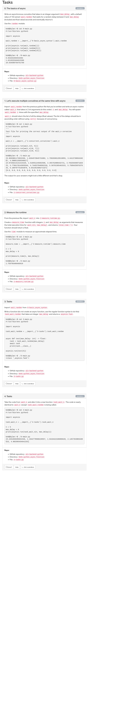

# Python - Async
## Resources
* [Async IO in Python: A Complete Walkthrough](https://realpython.com/async-io-python/)
* [asyncio - Asynchronous I/O](https://docs.python.org/3/library/asyncio.html)
* [random.uniform](https://docs.python.org/3/library/random.html#random.uniform)

## Tasks

